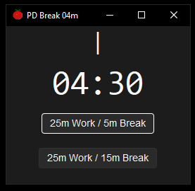
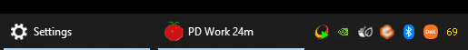

# 🧭🍅 PD Timer — A Desktop Pomodoro Countdown in Tkinter

A themed, multi-stage Pomodoro-style timer built with Python's `tkinter`, `sv_ttk`, and `pywinstyles`. 

---
## ✳️ Motivation

Looking into desktop application development and an interest in python, decided to give myself some motivation and focus with a [pomodoro](https://en.wikipedia.org/wiki/Pomodoro_Technique) timer project with my personal requirements of being minimal and non intrusive.

---

## ✨ Features

- ⏳ Two-stage countdown cycle (e.g., 25m Work + 5m Break / 15m Break)
- 🖥️ Windows 11 dark-themed title bar (via `pywinstyles`)
- 🌓 Dark mode UI with `sv_ttk`
- 🌀 Animated "working" indicator
- 🖼️ Dynamic window title updates (e.g., `PD Work 24`, `PD Break 05`)
---

## 📦 Requirements

- Python 3.8+
- `sv-ttk`
- `pywinstyles`

Install dependencies with:

```bash
pip install sv-ttk pywinstyles
```

## 🚀 Getting Started

1. Clone the repository or copy the files:
    ```
    countdown_timer.py
    pomodoro-desktop.py
    assets/tomato.ico
    ```

2. Install dependencies:

    ```bash
    pip install sv-ttk pywinstyles
    ```

3. Run the app:

    ```bash
    python pomodoro-desktop.py
    ```

---

## 🖼️ Project Structure
```
├── countdown_timer.py # Timer logic class
├── pomodoro-desktop.py # Main GUI and UI logic
├── assets/
│ └── tomato.ico # Optional window/taskbar icon
```

## 🍅 How It Works

- UI binds to virtual events (`<<TimerTick>>`, `<<TimerDone>>`)
- A single `CountdownTimer` class handles timing
- Two buttons let you choose:
  - 25m Work + 5m Break
  - 25m Work + 15m Break
- After Stage 1 (Work), it auto-starts Stage 2 (Break)
- The window title updates dynamically to reflect current mode and minutes left, no need to keep the application in focus.

---

## 📸 Screenshots





---

## 👤 Author

[richard](https://github.com/richardhill3)